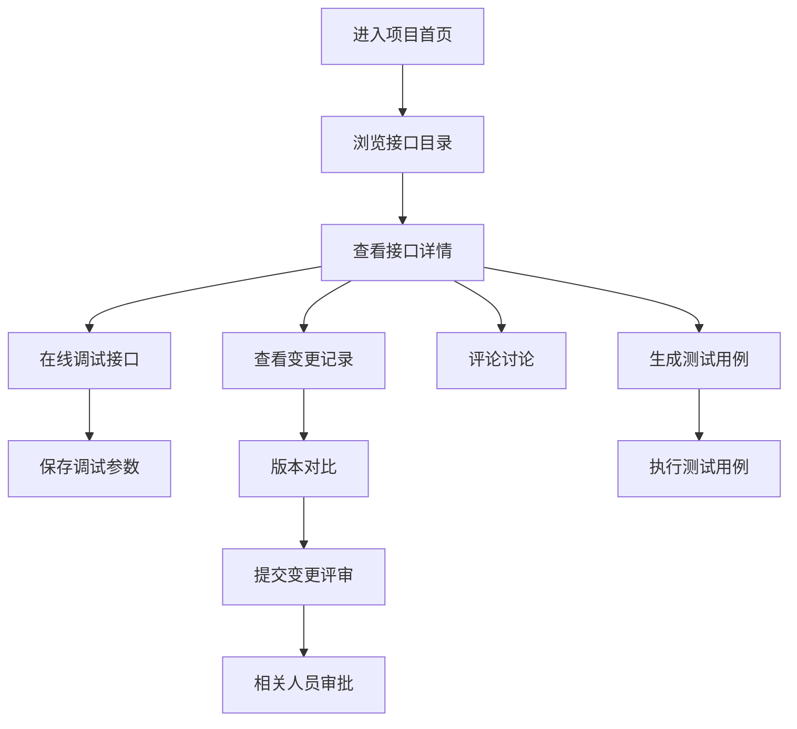

## 1. 产品概述

接口协作 Web 应用，供产品、前端、后端和测试团队在同一处维护接口约定，解决跨团队协作中接口信息不同步、文档分散、调试困难的问题。

- 目标用户：产品经理、前端工程师、后端工程师、测试工程师
- 核心价值：统一接口管理、提升协作效率、减少沟通成本、保证接口质量

## 2. 核心功能

### 2.1 用户角色

| 角色 | 核心权限 |
|------|----------|
| 项目管理员 | 项目配置、成员管理、权限设置、删除接口 |
| 开发者（产品/前后端/测试） | 编辑接口、在线调试、提交变更、评论讨论、管理用例 |
| 访客 | 浏览接口、查看文档、导出接口 |

### 2.2 功能模块

1. **项目首页**：项目概览、统计数据、最近变更、快捷入口
2. **接口目录**：模块树、接口列表、筛选搜索、收藏管理
3. **接口详情**：接口信息、参数定义、返回示例、错误码说明
4. **在线调试**：请求配置、参数填写、响应展示、保存调试参数
5. **用例管理**：测试用例列表、用例编辑、执行结果、用例生成
6. **变更记录**：版本列表、版本对比、变更评审、审批流程
7. **成员权限**：成员列表、角色管理、权限配置、邀请成员

### 2.3 页面详情

| 页面名称 | 模块名称 | 功能描述 |
|---------|---------|----------|
| 项目首页 | 统计概览 | 接口总数、模块数量、用例数量、成员数量 |
| 项目首页 | 最近变更 | 最新接口变更列表、提交人、时间 |
| 项目首页 | 快捷入口 | 新建接口、导入接口、调试记录、常用收藏 |
| 接口目录 | 模块树 | 按模块分组展示、折叠展开、拖拽排序 |
| 接口目录 | 接口列表 | 接口名称、方法、状态、创建人、更新时间 |
| 接口目录 | 筛选搜索 | 按状态筛选、关键词搜索、按模块筛选 |
| 接口详情 | 基础信息 | 接口名称、路径、方法、状态、标签、负责人 |
| 接口详情 | 请求参数 | Headers、Query、Body 参数定义、必填标识、字段说明 |
| 接口详情 | 返回示例 | 成功响应、错误响应、字段层级展示 |
| 接口详情 | 评论区 | 评论列表、@成员、回复功能 |
| 在线调试 | 请求配置 | 方法选择、URL 配置、Headers 设置 |
| 在线调试 | 参数填写 | 参数表单、JSON 编辑器、文件上传 |
| 在线调试 | 响应展示 | 响应状态、响应时间、响应体格式化展示 |
| 用例管理 | 用例列表 | 用例名称、关联接口、状态、最近执行结果 |
| 用例管理 | 用例编辑 | 请求参数、预期结果、断言配置 |
| 变更记录 | 版本列表 | 历史版本、提交信息、变更人、时间 |
| 变更记录 | 版本对比 | 差异对比、高亮显示、变更内容 |
| 变更记录 | 变更评审 | 提交评审、审批意见、评审状态 |
| 成员权限 | 成员列表 | 成员头像、姓名、角色、加入时间 |
| 成员权限 | 角色管理 | 角色定义、权限配置、默认角色 |
| 成员权限 | 项目设置 | 项目名称、描述、可见范围设置 |

## 3. 核心流程

### 3.1 主要用户流程

1. 用户进入项目首页，查看项目概览和最近变更
2. 进入接口目录，通过模块树或搜索找到目标接口
3. 查看接口详情，了解请求参数和返回格式
4. 使用在线调试功能测试接口，保存调试参数
5. 接口变更时提交评审，相关人员收到通知并审批
6. 测试人员根据接口文档生成测试用例并执行
7. 团队成员在评论区讨论接口问题，@相关人员

### 3.2 流程图

## 4. 用户界面设计

### 4.1 设计风格

- **主色调**：深蓝色系（#1677ff），代表专业、可信赖
- **辅助色**：绿色（成功）、橙色（警告）、红色（错误）、紫色（强调）
- **按钮风格**：圆角 6px，主按钮使用蓝色填充，次要按钮使用描边
- **字体**：现代无衬线字体，标题使用较粗字重，正文清晰易读
- **布局风格**：左侧导航 + 右侧内容区，卡片式布局，清晰的信息层级
- **图标风格**：线性图标，简洁现代，统一的 24px 网格

### 4.2 页面设计概述

| 页面名称 | 模块名称 | UI 元素 |
|---------|---------|---------|
| 项目首页 | 统计概览 | 数据卡片、渐变背景、图标动画 |
| 项目首页 | 最近变更 | 时间线布局、头像组件、状态标签 |
| 接口目录 | 模块树 | 树形组件、拖拽指示、折叠动画 |
| 接口目录 | 接口列表 | 表格布局、方法标签（GET/POST颜色区分）、状态徽章 |
| 接口详情 | 参数定义 | 可折叠面板、必填星号、类型标签、说明提示 |
| 在线调试 | 响应展示 | 代码高亮、Tab 切换、复制按钮 |
| 变更记录 | 版本对比 | 分栏对比、差异高亮、行号显示 |
| 成员权限 | 成员列表 | 头像、角色标签、操作按钮组 |

### 4.3 响应式设计

- Desktop-first 设计，优化 1280px 及以上分辨率
- 平板端（768px-1279px）：侧边栏可收起，内容区自适应
- 移动端（<768px）：底部导航、卡片堆叠展示
- 所有交互元素支持触摸操作，点击区域不小于 44px

### 4.4 动效设计

- 页面加载：淡入 + 上移动画，元素依次出现
-  hover 效果：轻微上浮 + 阴影加深
- 展开/收起：平滑的高度过渡
- 按钮点击：缩放反馈（0.98x）
- 通知提示：右上角滑入，自动消失
