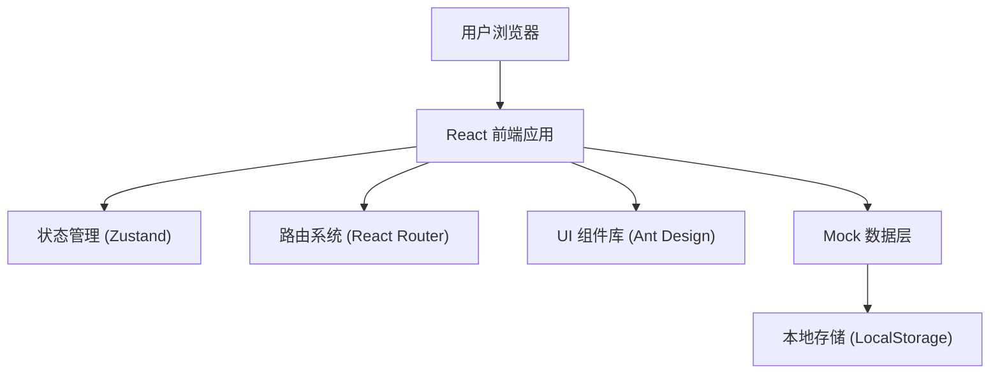
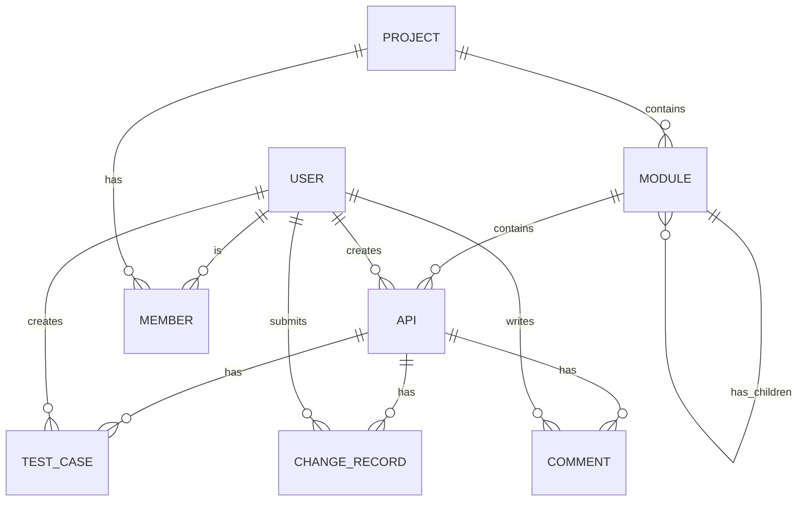

## 1. 架构设计



## 2. 技术描述

- **前端框架**：React@18 + TypeScript
- **构建工具**：Vite@5
- **UI 组件库**：Ant Design@5
- **路由管理**：React Router@6
- **状态管理**：Zustand
- **HTTP 请求**：Axios
- **样式方案**：TailwindCSS@3 + Less
- **代码高亮**：Prism.js / react-syntax-highlighter
- **图标库**：@ant-design/icons
- **数据模拟**：Mock 数据 + LocalStorage 持久化

## 3. 目录结构

```
src/
├── components/          # 公共组件
│   ├── Layout/         # 布局组件
│   ├── ApiMethodTag/   # 请求方法标签
│   ├── ParamTable/     # 参数表格
│   ├── ResponseView/   # 响应展示
│   └── CommentList/    # 评论列表
├── pages/              # 页面组件
│   ├── Home/           # 项目首页
│   ├── ApiList/        # 接口目录
│   ├── ApiDetail/      # 接口详情
│   ├── Debug/          # 在线调试
│   ├── TestCases/      # 用例管理
│   ├── Changes/        # 变更记录
│   └── Members/        # 成员权限
├── store/              # 状态管理
│   ├── apiStore.ts     # 接口数据 store
│   ├── userStore.ts    # 用户信息 store
│   └── projectStore.ts # 项目信息 store
├── mock/               # Mock 数据
│   ├── api.ts          # 接口数据
│   ├── modules.ts      # 模块数据
│   ├── users.ts        # 用户数据
│   └── testCases.ts    # 测试用例数据
├── types/              # TypeScript 类型定义
│   └── index.ts
├── utils/              # 工具函数
│   ├── request.ts      # 请求封装
│   ├── storage.ts      # 本地存储
│   └── helpers.ts      # 通用工具
├── App.tsx             # 根组件
├── main.tsx            # 入口文件
└── index.css           # 全局样式
```

## 4. 路由定义

| 路由 | 页面 | 说明 |
|------|------|------|
| / | 项目首页 | 项目概览、统计数据 |
| /api | 接口目录 | 模块树、接口列表 |
| /api/:id | 接口详情 | 接口信息、参数定义 |
| /api/:id/debug | 在线调试 | 接口调试、参数保存 |
| /test-cases | 用例管理 | 测试用例列表、编辑 |
| /changes | 变更记录 | 版本列表、对比、评审 |
| /members | 成员权限 | 成员管理、权限设置 |
| /error-codes | 错误码 | 错误码列表、维护 |

## 5. 数据模型定义

### 5.1 核心数据类型

```typescript
// 接口信息
interface Api {
  id: string;
  name: string;
  description: string;
  method: 'GET' | 'POST' | 'PUT' | 'DELETE' | 'PATCH';
  path: string;
  moduleId: string;
  status: 'draft' | 'developing' | 'testing' | 'completed' | 'deprecated';
  creator: string;
  owner: string;
  tags: string[];
  isFavorite: boolean;
  createdAt: string;
  updatedAt: string;
  request: ApiRequest;
  response: ApiResponse;
}

// 模块
interface Module {
  id: string;
  name: string;
  parentId: string | null;
  description: string;
  children?: Module[];
  apis?: string[];
}

// 请求参数
interface ApiRequest {
  headers: Param[];
  query: Param[];
  body: Param[];
}

// 参数定义
interface Param {
  id: string;
  name: string;
  type: 'string' | 'number' | 'boolean' | 'object' | 'array' | 'file';
  required: boolean;
  description: string;
  example: string;
  children?: Param[];
}

// 响应定义
interface ApiResponse {
  success: ResponseExample;
  error: ResponseExample[];
}

// 响应示例
interface ResponseExample {
  name: string;
  statusCode: number;
  description: string;
  data: any;
}

// 测试用例
interface TestCase {
  id: string;
  name: string;
  apiId: string;
  description: string;
  status: 'active' | 'inactive';
  request: {
    headers: Record<string, string>;
    query: Record<string, string>;
    body: any;
  };
  expected: {
    statusCode: number;
    body: any;
    assertions: Assertion[];
  };
  lastRunResult?: 'passed' | 'failed';
  lastRunAt?: string;
  creator: string;
  createdAt: string;
  updatedAt: string;
}

// 变更记录
interface ChangeRecord {
  id: string;
  apiId: string;
  version: string;
  title: string;
  description: string;
  changes: ChangeItem[];
  submitter: string;
  status: 'pending' | 'approved' | 'rejected';
  reviewers: string[];
  reviewComments?: ReviewComment[];
  createdAt: string;
  reviewedAt?: string;
}

// 成员
interface Member {
  id: string;
  name: string;
  email: string;
  avatar: string;
  role: 'admin' | 'developer' | 'viewer';
  joinedAt: string;
}

// 评论
interface Comment {
  id: string;
  apiId: string;
  content: string;
  author: string;
  mentions: string[];
  replyTo?: string;
  createdAt: string;
}
```

### 5.2 ER 图



## 6. 核心功能实现方案

### 6.1 模块树与接口列表
- 使用 Ant Design Tree 组件实现模块树形结构
- 接口列表使用 Table 组件，支持排序、筛选、分页
- 模块与接口的关联通过 moduleId 实现

### 6.2 参数定义与展示
- 递归组件实现嵌套参数的展示和编辑
- 必填字段用红色星号标识
- 支持拖拽调整参数顺序

### 6.3 在线调试
- 使用 Axios 发送 HTTP 请求（注意跨域问题，使用代理或 Mock）
- 支持多种 Content-Type：JSON、FormData、x-www-form-urlencoded
- 响应结果格式化展示，支持 JSON 高亮

### 6.4 版本对比
- 使用 diff 算法对比两个版本的差异
- 分栏展示，新增绿色高亮，删除红色高亮
- 支持行内对比和并排对比两种模式

### 6.5 评论与 @ 功能
- 使用富文本编辑器或 Markdown 编辑器
- @ 功能使用 mentions 插件
- 评论通知通过本地状态模拟

### 6.6 数据持久化
- 所有数据存储在 LocalStorage 中
- 页面加载时从 LocalStorage 读取数据
- 数据变更时自动同步到 LocalStorage
